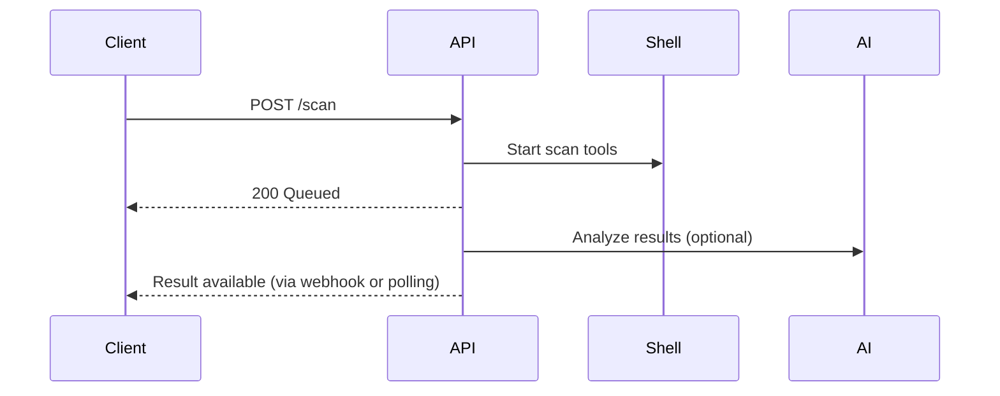

<p align="center">
  
</p>

<h1 align="center">🔐 Laravel Pentest Scanner Engine</h1>

<p align="center">
  A modular, API-driven automated vulnerability scanning engine powered by Laravel and command-line security tools. It serves as the backend engine for high-performance website and infrastructure security audits with optional AI-powered analysis.
</p>

<p align="center">
  <a href="https://api.pentestengine.com"><strong>API Docs</strong></a> •
  <a href="#features">Features</a> •
  <a href="#api-overview">API Overview</a> •
  <a href="#scan-types--modes">Scan Types</a> •
  <a href="#result-format">Result Format</a> •
  <a href="#workflow">Workflow</a> •
  <a href="#installation--setup">Installation</a> •
  <a href="#license">License</a>
</p>

---

## 📦 About

This Laravel service acts as the **scanning backend** for a pentesting and vulnerability analysis platform. It accepts scan requests from an Express or frontend client, runs selected scans via shell-based tools, processes results, and optionally forwards structured analysis to an external AI (e.g., Gemini or GPT).

---

## ⚙️ Features

- ✅ Full and fast scan modes with customizable options  
- ✅ Modular tool runner system (Nmap, SSLScan, etc.)  
- ✅ External AI API integration for structured scan result interpretation  
- ✅ Standardized JSON scan reports for frontend use  
- ✅ Optional webhook callback support  
- ✅ Result caching and file storage  
- ✅ Stateless and API-first design (no database required)

---

## 🚀 API Overview

| Method | Endpoint | Description |
|--------|----------|-------------|
| `POST` | `/api/scan` | Start a new scan (full, fast, or custom) |
| `GET` | `/api/result/{scan_id}` | Fetch scan result by ID |
| `POST` | *`callback_url`* | Optional webhook callback for completion |

> 📘 Base URL: `https://pentestengine.com/api/`

---

## 📊 Scan Types & Modes

| Scan Type | Full | Fast | Custom | Description |
|-----------|------|------|--------|-------------|
| **SSL**   | ✅   | ✅   | ✔️     | Certificate checks |
| **HTTP**  | ✅   | ✅   | ✔️     | Headers, redirects, policies |
| **Network** | ✅ | ✅ | ✔️     | Port & service scan |
| **Firewall** | ✅ | ✅ | ✔️     | Firewall detection |
| **WAF**     | ✅ | ❌ | ✔️     | Web app firewall detection |
| **Headers** | ✅ | ❌ | ✔️     | Full header scan |

---

## 🧾 Example Request

### 🔁 Full Scan
```bash
curl -X POST https://pentestengine.com/api/scan \
-H "Content-Type: application/json" \
-d '{
  "url": "https://example.com",
  "scan_type": "full",
  "scan_id": "full_scan_001"
}'
````

### ⚙️ Custom Scan (High Intensity)

```bash
curl -X POST https://pentestengine.com/api/scan \
-H "Content-Type: application/json" \
-d '{
  "url": "https://example.com",
  "scan_type": "custom",
  "scan_id": "custom_network_ssl",
  "custom_options": {
    "ssl": true,
    "network": true,
    "intensity": "high"
  }
}'
```

---

## 🧬 Result Format

```json
{
  "status": "completed",
  "scan_id": "scan_001",
  "message": "Scan completed successfully",
  "analysis": {
    "vulnerabilities": [
      {
        "title": "Expired SSL Certificate",
        "risk": "Critical",
        "description": "...",
        "remediation": "...",
        "evidence": "..."
      }
    ],
    "overall_assessment": {
      "total_vulnerabilities": 8,
      "risk_distribution": {
        "critical": 3,
        "high": 2,
        "medium": 2,
        "low": 1
      },
      "security_score": 30,
      "summary": "The server's SSL/TLS configuration exhibits critical vulnerabilities...",
      "strengths": ["TLS 1.2 support", "HSTS present"],
      "recommendations": ["Update SSL certificate", "Disable TLS 1.0"]
    }
  },
  "completed_at": "2025-05-19 17:08:53"
}
```

---

## 🧠 AI Integration

If enabled, raw scan data is sent to an external AI API (Gemini, GPT) for enhanced reporting. Output includes:

* Vulnerability titles, risks, and remediations
* Technical + business-level summaries
* Security score (0–100)
* Distribution of vulnerabilities by severity
* Suggested actions

---

## 🛠️ Installation & Setup

```bash
git clone https://github.com/soetjm/pentesting_system.git
cd pentesting_system/backend/laravel
composer install
cp .env.example .env
php artisan key:generate
php artisan serve
```

### Configure AI integration:

In your `.env`:

```
GEMINI_API_KEY=your-key
GEMINI_MODEL=gemini-pro
GEMINI_TIMEOUT=30
```


## 📈 Scan Lifecycle




## 📌 Notes

* ✅ Results retained for 30 days
* ✅ Scan duration: Fast (\~2 mins), Full (\~8 mins), Custom depends on scope
* ❌ Internal IP scanning disabled unless server has network access
* 🧪 AI fallback handling included in case of timeout or failure

---

## 📚 Future Plans

* Support for vulnerability CVE linking
* PDF export of reports
* Authenticated scan dashboard (admin UI)
* Internal IP + VPN probe integration


## 👨‍💻 Contact & Support

📧 **[support@pentestengine.com](mailto:support@pentestengine.com)**
🔗 [Website](https://pentestengine.com)
🔒 Built by Hailegiorgis and Team (Laravel Core)
